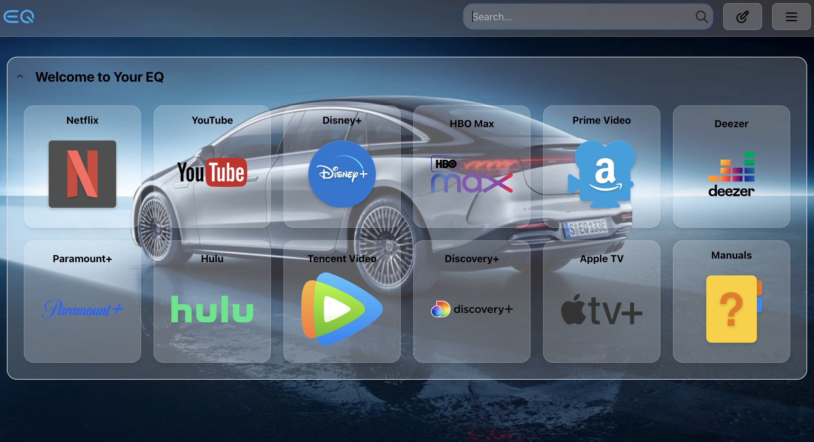

# MyEQ
Mercedes EQ Browser Dashboard and files

## What is this?
A dashboard for Mercedes EQ cars. It is a web application that runs on [Homarr](https://github.com/ajnart/homarr) and provides a dashboard to popular media services like Disney+, Deezer, YouTube, etc. It also provides a way to control the car's climate control and charging.

## Why?
I wanted to have a dashboard for my EQS like I had in my Tesla and I couldn't find anything that did all of this so I decided to build it myself.

## How to use it?
Vist https://myeq.app from your EQS to see the dashboard in action. Note that it will open the apps in the same window as the dashboard. This is because I agree with the Mercedes developers that it is a bad idea to allow popups from the car's browser by default. If you want to open the apps in a new window, select the config _popup_ from the config menu.

You can also run it locally by following the instructions TOBEADDED.

## What's next?
I'm currently working on a way to control the car's climate control and charging via Home Assistant as well as display the current state of the car. I'm also working on a way to control the car's media via Home Assistant. Prior however will probably go to adding support for cloud backup of dashcam footage.

## How does it look?

